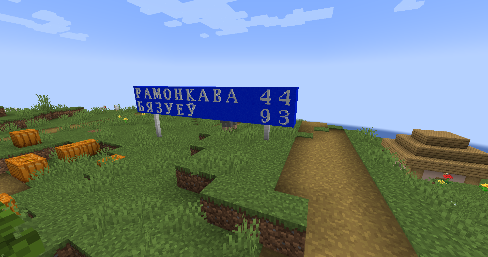

# AlPhAE's Letters

For this mod to work, you need to have a **Fabric API**.

# Preface
The idea of the mod came to me when I was building a map. I like traveling, so the map was connected to the railway and the cities that this road connected. Over time, the map grew, and a large number of road interchanges appeared, for which road signs were required. The idea with banners was not ideal for me, because I thought it didn't look very realistic, besides, not all the letters would have turned out beautifully (due to restrictions when creating banners), and there was a layer between each banner. Therefore, I decided to create new blocks, each block is a letter, and I chose the standard blue as the background, inherent in road signs in my region. It is my first mod written using the Fabric library. Please do not judge strictly😁

# Features
As mentioned earlier, the mod adds blocks on which letters are drawn, so that by putting these blocks next to each other, you can design names for buildings, signs... In principle, for everything that the soul desires! At the moment, the following alphabets are implemented (provided that **the common letters for the alphabets are in the tab with the Latin alphabet**):
- English;
- Russian;
- Byelorussian;
- Ukrainian.
### Usage Ideas
In my opinion, the most important idea with which I created this small modification is the creation of road signs. The following screenshot shows an example of creating a road sign using the Latin alphabet:

Another option for creating a road sign, but using the Russian language:

Another idea for the first point is pointers of distances to cities. The screenshot shows an example of such a sign in the Byelorussian language:

The mod also allows to design standard direction signs, indicating the distance if desired. The screenshot shows an example of such a sign in Ukrainian:

It is not necessary to use blocks only for the construction of road signs. They can be used even when you just want to make a sign for your store or just number a house in your city. After all, all that is required of you is to put blocks with letters, forming words!
# How to use
So far, to create each block, you first need to create a basic one - ferroconcrete. Below is the crafting of this block. It is worth noting that the crafting and appearance of the base block are planned to be changed in the future.

When a ferroconcrete block is received, it must be put into a stone cutter to get any variant of the letters blocks:

That's it! In the future, it is planned to add a special block to create letter blocks for greater realism.

It is worth noting that all blocks use 16x16 standard resolution textures to avoid an obvious difference between standard blocks and blocks from the mod.
# License
The project is licensed under Apache 2.0. For more information, please see the license file.