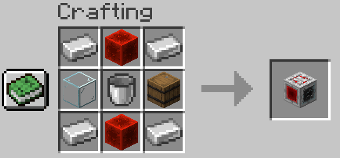
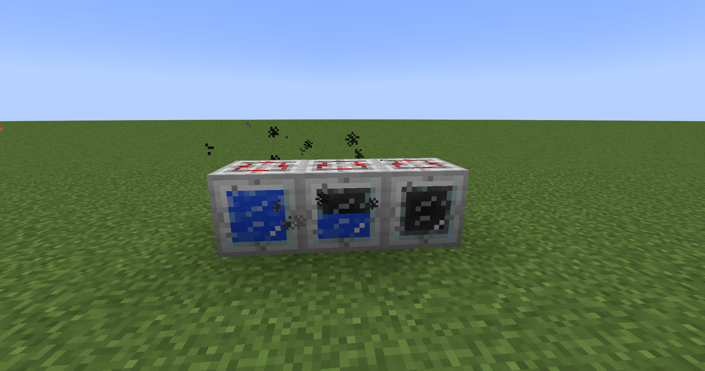
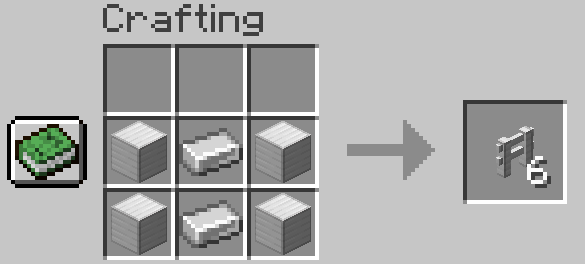

# AlPhAE's Letters

For this mod to work, you need to have a **Fabric API**.

# Preface
The idea of the mod came to me when I was building a map. I like traveling, so the map was connected to the railway and the cities that this road connected. Over time, the map grew, and a large number of road interchanges appeared, for which road signs were required. The idea with banners was not ideal for me, because I thought it didn't look very realistic, besides, not all the letters would have turned out beautifully (due to restrictions when creating banners), and there was a layer between each banner. Therefore, I decided to create new blocks, each block is a letter, and I chose the standard blue as the background, inherent in road signs in my region. It is my first mod written using the Fabric library. Please do not judge strictly😁

# Features
As mentioned earlier, the mod adds blocks on which letters are drawn, so that by putting these blocks next to each other, you can design names for buildings, signs... In principle, for everything that the soul desires! At the moment, the following alphabets are implemented (provided that **the common letters for the alphabets are in the tab with the Latin alphabet**):
- English;
- Russian;
- Byelorussian;
- Ukrainian;
- Bulgarian;
- Mongolian;
- Kazakh;
- Kyrgyz;
- Tajik;
- Uzbek (cyrillic);
- Turkmen (cyrillic);
- Tatar;
- French (without diacritics);
- Spanish (without diacritics);
- Italian;
- German.
### Usage Ideas
In my opinion, the most important idea with which I created this small modification is the creation of road signs. 
The following screenshot shows an example of creating a road sign using the Latin alphabet:

Yes, it's worth noting that letter blocks can emit light! To do this, you need to click on the block, holding a 
glowstone dust in your hand. Another option for creating a road sign, but using the Russian language:

Another idea for the first point is pointers of distances to cities. The screenshot shows an example of such a sign in 
the Byelorussian language:

The mod also allows to design standard direction signs, indicating the distance if desired. The screenshot shows an 
example of such a sign in Ukrainian:

The simplest road application of letter blocks is pointers of names of settlements:

But you can make a pointer to the end of settlements using a new block - strikethrough block:

It is not necessary to use blocks only for the construction of road signs. They can be used even when you just want to 
make a sign for your store or just number a house in your city. After all, all that is required of you is to put blocks 
with letters, forming words!
# How to use
It is worth saying that all the letters on the blocks have a 3D model:

So far, to create each block, you first need to create a basic one - ferroconcrete. But to create this block, you need
to create a block of white concrete powder with bars. This is the first step on the way to creating letter blocks.

An interesting fact is that after the destruction of the block, ordinary white concrete powder falls out, and bars remain 
in place of the block.

To get ferroconcrete from a block of concrete powder with bars, it is necessary to craft a dyeing machine:

This machine accepts a bucket of water, any block of concrete powder and a dye at the entrance, and concrete of the 
color of the dye is obtained at the output:

Depending on the amount of water in the internal tank, the appearance of the machine changes:

We also need to get blue ferroconcrete, so we use a dyeing machine, putting concrete powder with bars and
blue dye in it:

When a ferroconcrete block is received, it must be put into a stone cutter to get any variant of the letters blocks:

That's it! But these are not all available blocks! In the new tab "Technical blocks", there are also: iron fence,
iron gates, strikethrough block, which you can use to create more realistic road signs. For example, iron fence:

In addition to the construction of iron pens, it can be used for road sign posts. Fence crafting is next:

It is also possible to craft an iron gate:

Also, to craft a strikethrough block, you must have the following items:

In addition to creating crossed-out letters, this block can have other uses, for example, the construction of strange
structures like this:

It is worth noting that all blocks use 16x16 standard resolution textures to avoid an obvious difference between standard blocks and blocks from the mod.
# License
The project is licensed under Apache 2.0. For more information, please see the license file.